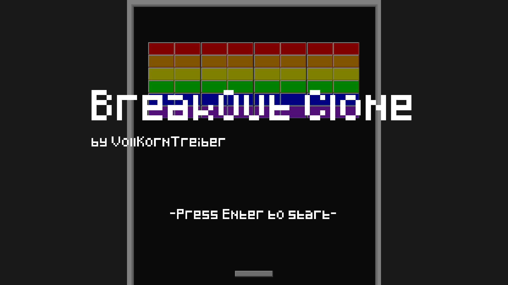
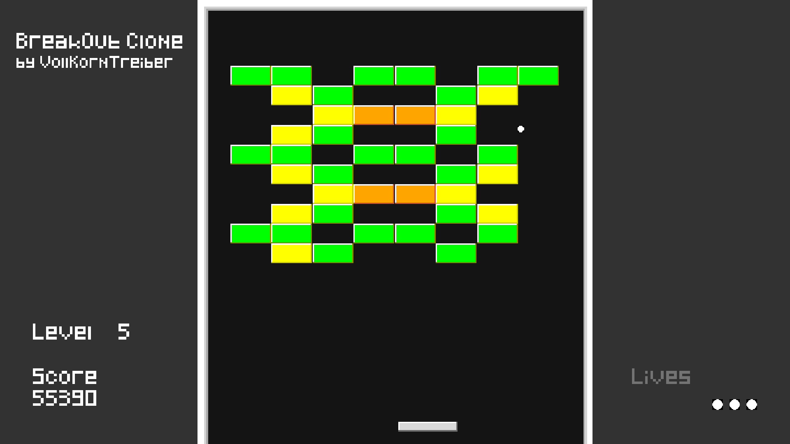
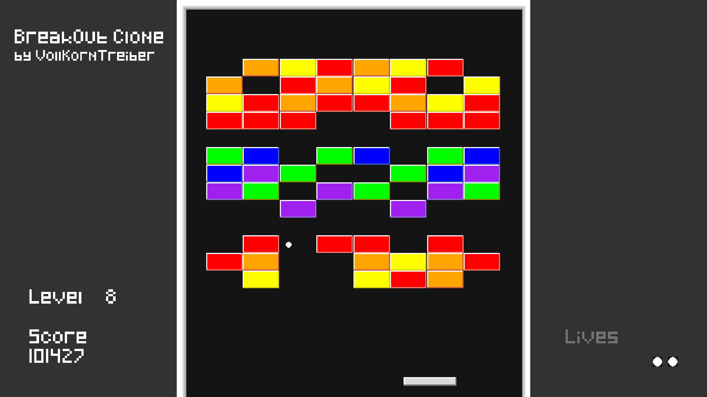

# vktBreakOut

A simple Breakout-like clone and personal exercise in basic game development and Python 3. 
Based on several "Clear Code" tutorials on Youtube. Really nice guy! 
Font Pixeled.ttf by "OmegaPC777", as used in the tutorials. 
Have fun!

<h2>Requirements</h2>
<ul>
    <li>Pygame ver. 2, preferably installed via pip3</li>
</ul>

<h2>Controls</h2>
<ul>
    <li> Arrow keys: Move paddle</li>
    <li> Shift + Arrow keys: Move paddle faster</li>
    <li> Space: Activate ball</li>
    <li> ESC: Reset to main menu</li>
    <li> F: Toggle fullscreen</li>
</ul>

<h2>Screenshots</h2>

<h2>Changelog</h2>
<ul>
    <li>v1
        <ul>
            <li>Initial release</li>
        </ul>
    </li>
    <li>v0.9
        <ul>
            <li>Added sound</li>
        </ul>
    </li>

</ul>